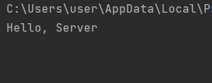
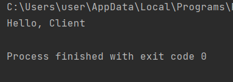
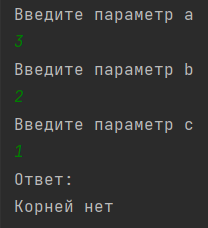
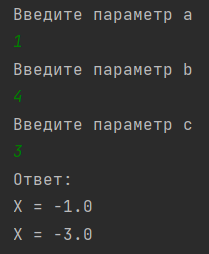
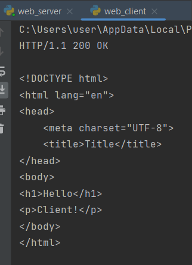
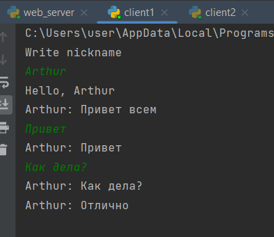
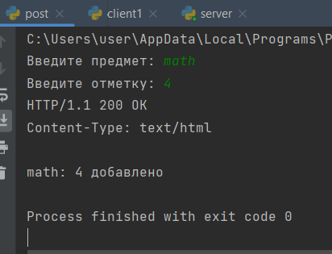

# Задание 1

## Описание Задачи

Цель задания - реализовать простое клиент-серверное приложение с использованием сокетов и протокола UDP. Клиент
отправляет сообщение "Hello, server" на сервер, который, в свою очередь, отвечает сообщением "Hello, client". Важно
обеспечить корректную передачу сообщений и их отображение на обеих сторонах.

## Реализация

### Серверная Часть

Файл: `server.py`

Сервер прослушивает входящие UDP-сообщения и отправляет ответ. Сервер ожидает сообщения от клиента, выводит его
содержимое в консоль, а затем отправляет обратно клиенту сообщение "Hello, Client!".

```python
import socket
HOST = '127.0.0.1'
PORT = 9093
conn = socket.socket(socket.AF_INET, socket.SOCK_STREAM)
conn.bind((HOST, PORT))
conn.listen()


while True:
    cl_socket, cl_addr = conn.accept()
    data = cl_socket.recv(1024)
    udata = data.decode('utf-8')
    print(udata)

    msg = "Hello, Client".encode('utf-8')
    cl_socket.send(msg)
```

### Клиентская Часть

Файл: `client.py`

Клиент отправляет сообщение "Hello, server!" на сервер и ожидает ответа. После получения ответа от сервера, содержимое
сообщения выводится в консоль.

```python
import socket
HOST = '127.0.0.1'
PORT = 9093
conn = socket.socket(socket.AF_INET, socket.SOCK_STREAM)
conn.connect((HOST, PORT))


conn.send("Hello, Server".encode('utf-8'))
data = conn.recv(1024).decode('utf-8')
print(data)
conn.close()
```




# Задание 2

## Описание Задачи

Задача заключается в реализации клиент-серверного приложения на Python с использованием библиотеки `socket`. Клиент
запрашивает у сервера выполнение математической операции — расчет по теореме Пифагора, основываясь на параметрах,
вводимых пользователем. Сервер обрабатывает запрос, выполняет вычисления и возвращает результат клиенту.

## Реализация

### Серверная Часть

Файл: `server.py`

Сервер ожидает подключение клиента, запрашивает данные (значения `a`, `b`, `c`), решает квадратное уравнение и отправляет ответ клиенту

```python
import socket
HOST = '127.0.0.1'
PORT = 9093
conn = socket.socket(socket.AF_INET, socket.SOCK_STREAM)
conn.bind((HOST, PORT))
conn.listen()


def find_solution(a, b, c):
    disc = b ** 2 - 4 * a * c
    if disc < 0:
        return None
    elif disc == 0:
        return -b / 2 / a
    else:
        sqr_disc = disc ** (1 / 2)
        return (-b + sqr_disc) / 2 / a, (-b - sqr_disc) / 2 / a


while True:
    cl_socket, cl_addr = conn.accept()
    params = dict.fromkeys(["a", "b", "c"])
    for param in params:
        cl_socket.send(f"Введите параметр {param}".encode("utf-8"))
        data = cl_socket.recv(1024)
        params[param] = int(data.decode("utf-8"))
    res = find_solution(params["a"], params["b"], params["c"])

    msg = "Ответ: \n"
    if res:
        for x in res:
            msg += f"X = {x}\n"
    else:
        msg += "Корней нет"
    cl_socket.send(msg.encode("utf-8"))

```

### Клиентская Часть

Файл: `client.py`

Клиент подключается к серверу, отправляет данные для расчета и ожидает результат от сервера.

```python
import socket
HOST = '127.0.0.1'
PORT = 9093
conn = socket.socket(socket.AF_INET, socket.SOCK_STREAM)
conn.connect((HOST, PORT))

for i in range(3):
    data = conn.recv(1024)
    print(data.decode("utf-8"))
    param = str(input()).encode("utf-8")
    conn.send(param)
data = conn.recv(1024).decode("utf-8")
print(data)
```




# Задание 3

## Описание Задачи

Задача заключается в разработке серверной части приложения, которая отправляет HTTP-ответ с HTML-страницей клиенту при
его подключении. HTML-страница должна загружаться из файла `index.html`.

## Реализация

### Серверная Часть

Файл: `web_server.py`

Сервер использует протокол TCP для прослушивания подключений клиентов. При подключении клиента сервер загружает
HTML-страницу из файла `index.html` и отправляет её клиенту.

```python
import socket
HOST = '127.0.0.1'
PORT = 9093
conn = socket.socket(socket.AF_INET, socket.SOCK_STREAM)
conn.bind((HOST, PORT))
conn.listen()


def handle_request(client_socket):
    request = cl_socket.recv(1024).decode("utf-8")
    if request.startswith('GET / HTTP'):
        send_html(client_socket)


def send_html(client_socket):
    with open("index.html", "r") as file:
        response = 'HTTP/1.1 200 OK\n\n'
        response += file.read()
        client_socket.send(response.encode("utf-8"))


while True:
    cl_socket, cl_addr = conn.accept()
    handle_request(cl_socket)
```
Файл: `web_client.py`

```python
import socket
HOST = '127.0.0.1'
PORT = 9093
conn = socket.socket(socket.AF_INET, socket.SOCK_STREAM)
conn.connect((HOST, PORT))

request = 'GET / HTTP/1.1\r\n\r\n'
conn.send(request.encode("utf-8"))
response = conn.recv(1024).decode("utf-8")
print(response)
conn.close()

```

### HTML-Страница

Файл: `index.html`

Простая HTML-страница, отправляемая сервером:

```html
<!DOCTYPE html>
<html lang="en">
<head>
    <meta charset="UTF-8">
    <title>Title</title>
</head>
<body>
<h1>Hello</h1>
<p>Client!</p>
</body>
</html>
```

# Задание 4

## Описание Задачи

Задание включает в себя разработку многопользовательского чата. Целью является создание серверной и клиентской части
приложения, где клиенты могут подключаться к серверу и обмениваться сообщениями. Важно использовать
библиотеку `threading` для обработки множественных клиентских соединений и передачи сообщений в реальном времени.

## Реализация

### Серверная Часть

Файл: `web_server.py`

```python
import socket
import threading

HOST = '127.0.0.1'
PORT = 9093

cl_nick_socket = {}


def handle_client(cl_socket):
    nickname = cl_socket.recv(1024).decode("utf-8")
    cl_socket.send(f"Hello, {nickname}".encode("utf-8"))
    cl_nick_socket[nickname] = cl_socket

    while True:
        message = cl_socket.recv(1024).decode("utf-8")
        if not message:
            del cl_nick_socket[nickname]
            break
        for name, cl_tmp_socket in cl_nick_socket.items():
            cl_tmp_socket.send(f"{name}: {message}".encode("utf-8"))
    cl_socket.close()

conn = socket.socket(socket.AF_INET, socket.SOCK_STREAM)
conn.bind((HOST, PORT))
conn.listen()

while True:
    cl_socket, cl_addr = conn.accept()
    cl_thread = threading.Thread(target=handle_client, args=(cl_socket,))
    cl_thread.start()
```

### Клиентская Часть

Файл: `client.py`

Клиент подключается к серверу, отправляет и получает сообщения. Каждый клиент имеет возможность отправлять сообщения,
которые будут видны всем подключенным клиентам.

```python
import socket
import threading

HOST = '127.0.0.1'
PORT = 9093

conn = socket.socket(socket.AF_INET, socket.SOCK_STREAM)
conn.connect((HOST, PORT))


def receive_msg():
    while True:
        msg = conn.recv(1024).decode("utf-8")
        print(msg)


nickname = input("Write nickname\n")
conn.send(nickname.encode("utf-8"))

receive_thread = threading.Thread(target=receive_msg)
receive_thread.start()

while True:
    msg = input()
    conn.send(msg.encode("utf-8"))
```



# Задание 5

## Описание Задачи

Задача заключается в создании простого web-сервера на Python, который может обрабатывать GET и POST HTTP-запросы. Сервер
должен принимать и записывать информацию о дисциплине и оценке, а также отдавать информацию обо всех оценках по
дисциплине в виде HTML-страницы.

## Реализация

Файл: `server.py`

```python
import socket
from collections import defaultdict

class MyHTTPServer:
    def __init__(self, ip, port):

        self.conn = socket.socket(socket.AF_INET, socket.SOCK_STREAM)
        self.conn.setsockopt(socket.SOL_SOCKET, socket.SO_REUSEADDR, 1)
        self.conn.bind((host, port))
        self.conn.listen(5)

        self.grades = defaultdict(list)

    # Старт сервера
    def serve_forever(self):
        while True:
            client, addr = self.conn.accept()
            self.serve_client(client)

    # Прослушивание клиента
    def serve_client(self, client):
        data = client.recv(2 * 16384).decode(encoding="utf-8", errors="ignore")
        self.parse_request(client, data)

    # Парсим запросы
    def parse_request(self, client, data):
        lines = data.split("\n")
        method, url, version = lines[0].split()

        if method == "GET":
            params = (
                {p.split("=")[0]:p.split("=")[1] for p in url.split("?")[1].split("&")}
                if "?" in url
                else None
            )

        elif method == "POST":
            discipline = None
            grade = None

            for line in lines:
                if 'Content-Disposition: form-data; name="discipline"' in line:
                    discipline = lines[lines.index(line) + 2].strip()
                elif 'Content-Disposition: form-data; name="grade"' in line:
                    grade = lines[lines.index(line) + 2].strip()

            params = {"discipline": discipline, "grade": grade}

        else:
            params = None

        self.handle_request(client, method, params)

    # Обработка  запросов
    def handle_request(self, client, method, params):
        if method == "GET":
            self.send_response(client, 200, "OK", self.generate_html())
            print("GET 200 OK")
        elif method == "POST":
            discipline = params.get("discipline")
            grade = params.get("grade")
            self.grades[discipline].append(grade)
            self.send_response(client, 200, "OK", f'{discipline}: {grade} добавлено')
            print("POST 200 OK")
        else:
            self.send_response(client, 404, "Not Found")
            print("ERR  404")

    # Отправка ответа
    def send_response(self, client, code, reason, body):
        response = f"HTTP/1.1 {code} {reason}\nContent-Type: text/html\n\n{body}"
        client.send(response.encode("utf-8"))
        client.close()

    # Генерация HTML
    def generate_html(self):
        page = (
            "<html><body><div>"
            f"{''.join([f'<p>{discipline}: {grade}</p>' for discipline, grade in self.grades.items()])}"
            "</div></body></html>"
        )
        return page

if __name__ == "__main__":
    host = "localhost"
    port = 9093
    server = MyHTTPServer(host, port)
    try:
        server.serve_forever()
    except KeyboardInterrupt:
        server.conn.close()
```

Файл: `get.py`

```python
import socket

sock = socket.socket(socket.AF_INET, socket.SOCK_STREAM)
sock.connect(("localhost", 9093))

request = "GET /scores?subject=math HTTP/1.1\nContent-Type: text"
sock.send(request.encode())

response = sock.recv(2 * 1024).decode()
print(response)
```


Файл: `post.py`


```python
import socket

sock = socket.socket(socket.AF_INET, socket.SOCK_STREAM)
sock.connect(("localhost", 9093))

discipline = input('Введите предмет: ')
grade = input('Введите отметку: ')

body = f"Content-Disposition: form-data; name=\"discipline\"\r\n\r\n{discipline}\r\n"
body += f"Content-Disposition: form-data; name=\"grade\"\r\n\r\n{grade}\r\n"

# Создаем POST-запрос с правильным форматом и контентом
request = f"POST / HTTP/1.1\r\nHost: localhost\r\nContent-Type: multipart/form-data\r\nContent-Length: {len(body)}\r\n\r\n{body}"


# Создаем POST-запрос с правильным форматом и контентом
request = f"POST / HTTP/1.1\nHost: localhost\nContent-Type: application/x-www-form-urlencoded\nContent-Length: {len(body)}\n\n{body}"

sock.send(request.encode())

response = sock.recv(2*1024).decode()
print(response)

sock.close()
```



