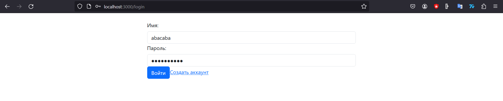
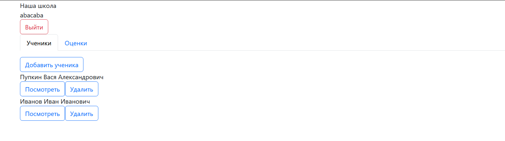
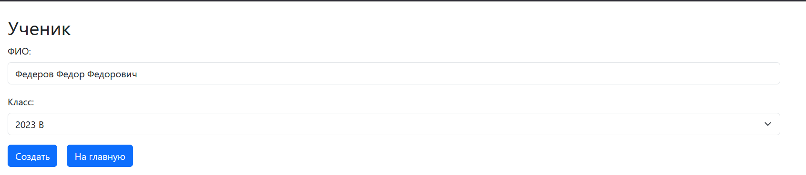
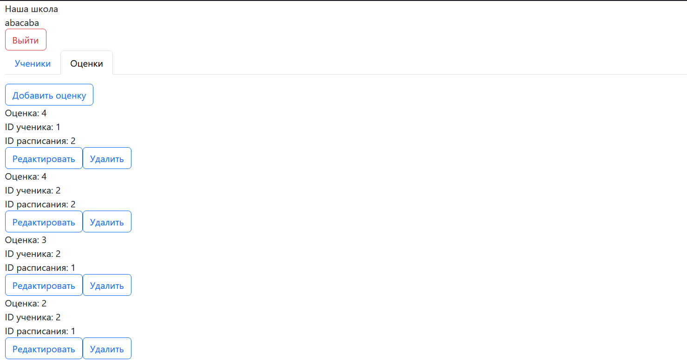
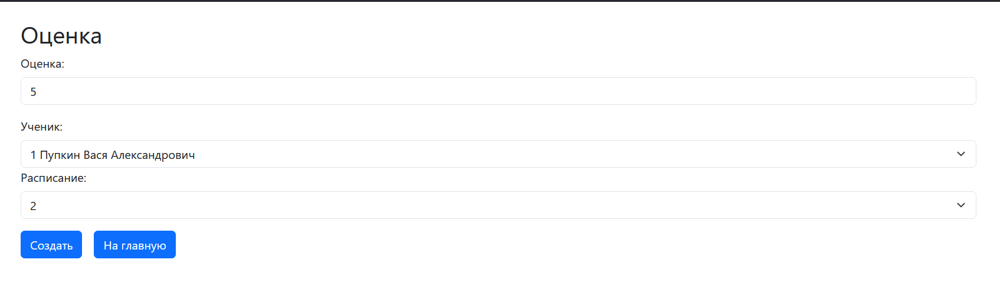

## App.js

```python
import React, { useEffect, useState } from "react";
import { Route, Routes, useLocation, useNavigate } from "react-router-dom";
import Login from "./page/Login";
import { PrivateRoute } from "./components/PrivateRoute";
import "./App.css";
import Registration from "./page/Registration";
import StudentList from "./page/StudentList"
import StudentForm from "./page/StudentForm/StudentForm";
import GradesList from "./page/GradesList/GradesList";
import GradesForm from "./page/GradesForm/GradesForm";
import GradeUpdateForm from "./page/GradeUpdateForm/GradeUpdateForm";
import Main from "./page/Main";
import StudentInfo from "./page/StudentInfo/StudentInfo";

function App() {
  return (
    <div>
      <Routes>
        <Route path="/">
          <Route path="/login" element={<Login />} />
          <Route path="/registration" element={<Registration />} />

          <Route element={<PrivateRoute />}>
            <Route index element={<Main />} />
            <Route path="/students" element={<StudentList />} />
            <Route path="/students/create" element={<StudentForm />} />
            <Route path="/grades/create" element={<GradesForm />} />
            <Route path="/grade/update/:gradeId" element={<GradeUpdateForm />} />
            <Route path="student/info/:studentId" element={<StudentInfo />} />
            <Route path="/grade" element={<GradesList />} />
          </Route>
        </Route>
      </Routes>
    </div>
  );
}

export default App;
```
## Main

```python
import React, { useEffect, useState } from "react";
import { useNavigate, useParams } from "react-router-dom";
import useUser from "../../hooks/useUser";
import Header from "../../components/Header";
import Tab from "react-bootstrap/Tab";
import Tabs from "react-bootstrap/Tabs";
import StudentList from "../StudentList";
import GradesList from "../GradesList/GradesList";


function Main() {
  const navigate = useNavigate();
  const [user, setUser] = useState([]);
  const [data, setData] = useState([]);
  const { token } = useUser();

  useEffect(() => {
    fetch("http://localhost:8000/api/auth/users/me", {
      method: "GET",
      headers: {
        Authorization: `Token ${token}`,
      },
    })
      .then((response) => response.json())
      .then((result) => {
        setUser(result);
      })
      .catch((error) => console.error("Error fetching data:", error));
  }, [token]);

  return (
    <>
      <Header username={user.username} />
      <div className="main-container container">
        <Tabs
          defaultActiveKey="Students"
          id="uncontrolled-tab-example"
          className="mb-3"
        >
          <Tab eventKey="Students" title="Ученики">
            <StudentList />
          </Tab>
          <Tab eventKey="Grades" title="Оценки">
            <GradesList />
          </Tab>
        </Tabs>
      </div>
    </>
  );
}

export default Main;
```
## StudentForm

```python
import React, { useEffect, useState } from "react";
import useUser from "../../hooks/useUser";
import { useNavigate } from "react-router-dom";
import { Form, Button, Row, Col } from "react-bootstrap";


function StudentForm() {
  const { setToken, token } = useUser();
  const navigate = useNavigate();
  const [formData, setFormData] = useState({
    FIO: "",
    klass: null,

  });

  const [availableClasses, setAvailableClasses] = useState([]);


  useEffect(() => {
    fetch("http://127.0.0.1:8000/api/classes/all", {
      method: "GET",
      headers: {
        Authorization: `Token ${token}`,
      },
    })
      .then((response) => response.json())
      .then((result) => {
        setAvailableClasses(result);
      })
      .catch((error) => console.error("Error fetching data:", error));
  }, [token]);

  const handleChange = (event) => {
    const { name, value } = event.target;

    if (name === "class") {
      const selectedValues = Array.from(
        event.target.selectedOptions,
        (option) => option.value
      );

      setFormData({
        ...formData,
        [name]: selectedValues,
      });
    } else {
      setFormData({
        ...formData,
        [name]: value,
      });
    }
  };

  const handleSubmit = (event) => {
    event.preventDefault();
    console.log("Form submitted:", formData);
    fetch("http://127.0.0.1:8000/api/students/create/", {
      method: "POST",
      headers: {
        "Content-Type": "application/json",
        Authorization: `Token ${token}`,
      },
      body: JSON.stringify(formData),
    })
      .then((response) => response.json())
      .then((result) => {
        console.log("Success:", result);
        navigate("/");
      })
      .catch((error) => console.error("Error:", error));
  };

  return (
    <div className="container mt-4">
      <h2>Ученик</h2>
      <Form onSubmit={handleSubmit}>
        <Row className="mb-3">
            <Form.Group controlId="student">
                <Form.Label>ФИО:</Form.Label>
                        <Form.Control
                    type="text"
                    name="FIO"
                    value={formData.FIO}
                    onChange={handleChange}
                />
            </Form.Group>
        </Row>

        <Form.Group controlId="klass">
          <Form.Label>Класс:</Form.Label>
          <Form.Select
            name="klass"
            value={formData.klass}
            onChange={handleChange}
          >
            <option value="">Выбор класса</option>
            {availableClasses.map((klass) => (
              <option key={klass.id} value={klass.id}>
                {klass.year}  {klass.litera}
              </option>
            ))}
          </Form.Select>
        </Form.Group>

        <Button variant="primary" type="submit">
          Создать
        </Button>
        <Button
          variant="primary"
          onClick={() => {
            navigate("/");
          }}
          className="m-3"
        >
          На главную
        </Button>
      </Form>
    </div>
  );
}

export default StudentForm;
```

## StudentInfo

```python
import React, { useCallback, useEffect, useState } from "react";
import { useNavigate, useParams } from "react-router-dom";
import Button from "react-bootstrap/Button";
import useUser from "../../hooks/useUser";


function StudentInfo() {
    const [student, setStudent] = useState([]);
    const navigate = useNavigate();
    const { studentId } = useParams();
    const { token } = useUser();
    

    const getStudents = useCallback(() => {

    }, [studentId,token]);
    useEffect(() => {fetch(`http://127.0.0.1:8000/api/students/${studentId}`,{
        method: "GET",
        headers: {
          Authorization: `Token ${token}`,
        },
      })
        .then(response => response.json())
        .then(data => {setStudent(data); console.log(data)})
        .catch(error => console.error('Ошибка:', error));}, [studentId, token, setStudent]);
  
    return (
      <div>
        <h3>{student.FIO}</h3>
        <p>Класс: {student.klass}</p>
        <h3>Оценки:</h3>
        <ul>
        {student.grades_set?.map(grade => (
          <li key={grade.id}>
            Оценка: {grade.grade}
          </li>
        ))}
      </ul>
        {/* <h2>Расписание:</h2>
        <ul>
          {student.schedules.map(schedule => (
            <li key={schedule}>Расписание {schedule}</li>
          ))}
        </ul>  */}
      </div>
    );
}

export default StudentInfo;
```

## Grades

```python
import React, { useCallback, useEffect, useState } from "react";
import { useNavigate, useParams } from "react-router-dom";
import Button from "react-bootstrap/Button";
import useUser from "../../hooks/useUser";


function Grades({ grade, getGrades }) {
  const navigate = useNavigate();
  const { token } = useUser();
  const [routeData, setRouteData] = useState("");

  const onDelete = (grade) => {
    fetch(`http://127.0.0.1:8000/api/grades/delete/${grade.id}/`, {
      method: "DELETE",
      headers: {
        Authorization: `Token ${token}`,
      },
    }).then(() => getGrades());
  };

  return (
    <div className="cell-container">
      <div>
        <div>
           <div>
              Оценка: {grade.grade}
            </div>
            <div>
              ID ученика: {grade.student}
            </div>
            <div>
              ID расписания: {grade.schedule}
            </div>
        </div> 
      </div>
      <div className="cell-route">
        
        <div>{routeData.destination_point}</div>
      </div>
      <div className="cell-button-group">
        {/* <btn
          className="cell-button"
          onClick={() => navigate(`student/edit/${student.id}`)}
        /> */}

        <Button
            onClick={() => navigate(`grade/update/${grade.id}`)}
            variant="outline-primary"
          >
            Редактировать
          </Button>

        <Button
            onClick={() => onDelete(grade)}
            variant="outline-primary"
          >
            Удалить
          </Button>
      </div>
    </div>
  );
}

export default Grades;
```


## GradesList

```python
import React, { useCallback, useEffect, useState } from "react";
import { useNavigate, useParams } from "react-router-dom";
import Button from "react-bootstrap/Button";
import useUser from "../../hooks/useUser";
import Grades from "./Grades";


function GradesList() {
  const navigate = useNavigate();
  const { token } = useUser();
  const [grades, setGrades] = useState([]);

  const getGrades = useCallback(() => {
    fetch("http://localhost:8000/api/grades/all/", {
      method: "GET",
      headers: {
        Authorization: `Token ${token}`,
      },
    })
      .then((response) => response.json())
      .then((result) => {
        setGrades(result);
      })
      .catch((error) => console.error("Error fetching data:", error));
  }, [token]);

  useEffect(() => getGrades(), [getGrades]);

  return (
    <div>
      {grades ? (
        <>
          <Button
            onClick={() => navigate("/grades/create")}
            variant="outline-primary"
          >
            Добавить оценку
          </Button>
          <div className="cell-group">
            {grades.map((grade, id) => (
              <Grades grade={grade} getGrades={getGrades} key={id} />
            ))}
          </div>
        </>
      ) : (
        <></>
      )}
    </div>
  );
}

export default GradesList;
```








